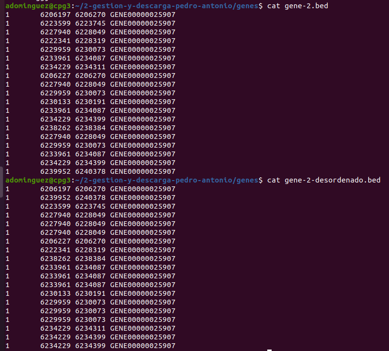
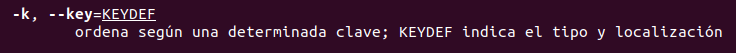
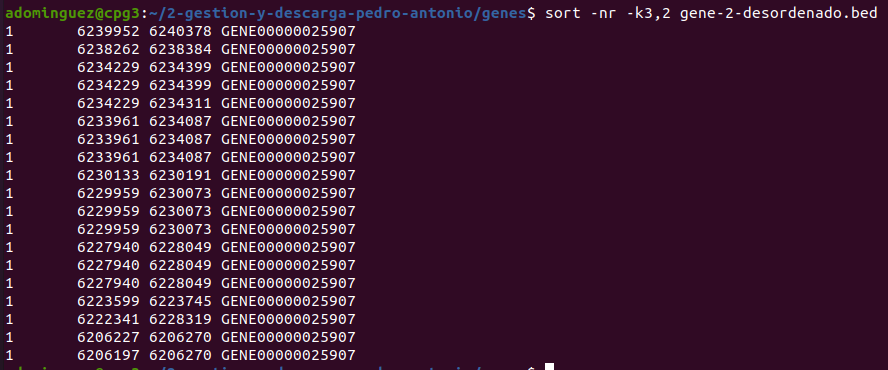
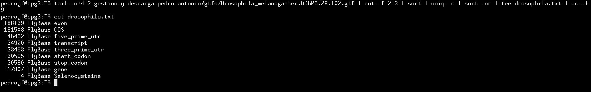
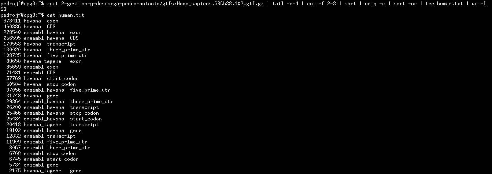
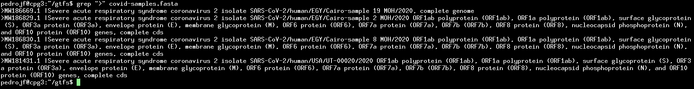
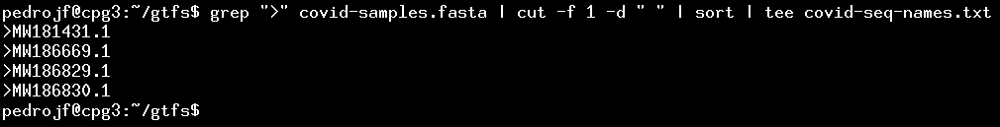
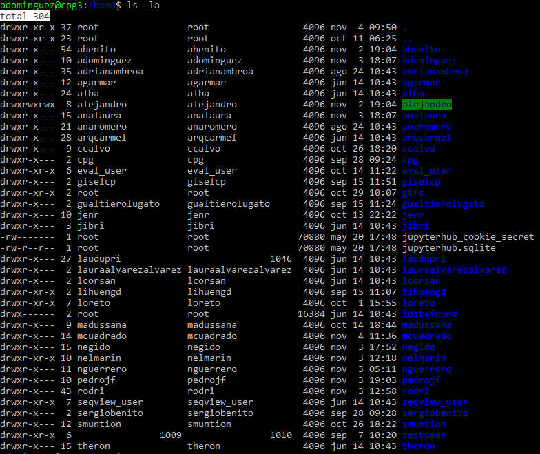
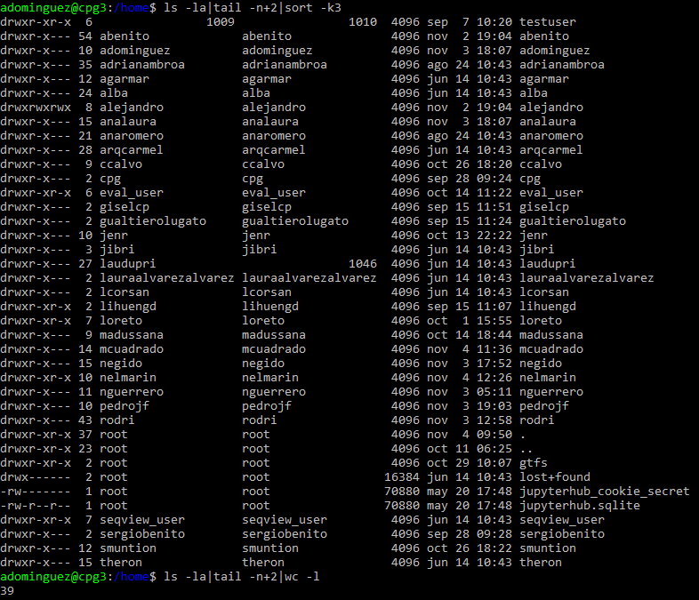
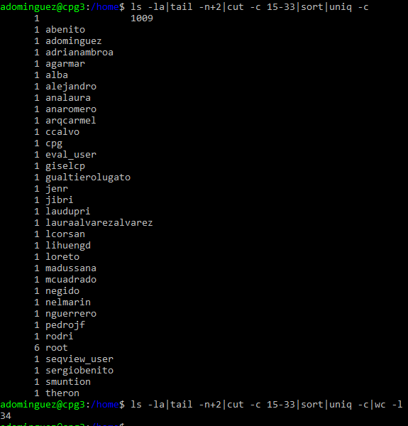

# Sesión III - Redireccionamiento, filtros y pipes

Herramientas computacionales para bioinformática: UNIX, expresiones regulares y shell script

Edita esta plantilla en formato markdown [Guía aquí](https://guides.github.com/features/mastering-markdown/) como se pide en el guión. 
Cuando hayas acabado, haz un commit de tus cambios y súbelos al repositorio antes de la fecha de entrega señalada. 

======================================

## Ejercicio 1
`sort -R` (random) desordena las líneas de un fichero. Prueba a desordenar el fichero `gene-2.bed` y crea un nuevo fichero llamado `gene-2-desordenado.bed`.

Trata ahora de ordenar este fichero de acuerdo a los siguientes criterios: 
1. Sin cortar los elementos
2. En orden descendente
3. Usando a la vez la tercera y la segunda columna (en este orden de prioridad). Consulta el manual para ver la opción -k. 

### Respuesta ejercicio 1
En primer lugar se crea un fichero llamado "gene-2-desordenado.bed" a partir del comando sort -R ejecutado sobre el fichero `gene-2.bed`. Se ha empleado el comando: 
`sort -R gene-2.bed > gene-2-desordenado.bed`
Tras esto empleamos cat para ver el contenido del fichero `gene-2.bed` y del fichero desordenado que se ha creado en nuestra carpeta `gene-2-desordenado.bed`

Para ordenar el fichero creado `gene-2-desordenado.bed` siguiendo los pasos del ejercicio. Dado que no hay que cortar elementos, no emplearemos el comando `cut`. 
En segundo lugar para ordenar números en orden descendente emplearemos el comando:
`sort -nr gene-2-desordenado.bed`
Y para ordenar usando la tercera y segunda columna según el orden de prioridad emplearemos el comando: 
`sort -k3,4 gene-2-desordenado.bed `
Antes de esto hemos consultado el manual para ver como se emplearia la opción -k de sort: 
`man sort`

Empleando los dos comandos a la vez nos quedaría así:
`sort -nr -k3,2 gene-2-desordenado.bed`
Con esto nos ordenará el fichero en orden descendente usándo la tercera columna para ordenar valores y después emplea la segunda columna.
 

## Ejercicio 2

Cuáles son y cuántos tipos distintos de "features" hay en `Drosophila_melanogaster.BDGP6.28.102.gtf` y en `Homo_sapiens.GRCh38.102.gtf.gz`? Nota: para trabajar con ficheros .gunzip sin descomprimir puedes usar `zcat`.

### Respuesta ejercicio 2

Para comprobar cuántos tipos de freatures distintos hay en `Drosophila_melanogaster.BDGP6.28.102.gtf` hemos empleado el siguiente pipeline: `tail -n+4 2-gestion-y-descarga-pedro-antonio/gtfs/Drosophila_melanogaster.BDGP6.28.102.gtf | cut -f 2-3 | sort | uniq -c | sort -nr | tee drosophila.txt | wc -l`. Los resultados obtenidos han sido los siguientes:

Como se puede comprobar el comando `wc -l` muestra que hay 9 líneas, por lo tanto hay 9 tipos de freatures diferentes, estos pueden consultarse en el siguiente archivo de texto: [drosophila](documents/drosophila.txt).

Para comprobar cuántos tipos de freatures distintos hay en `Homo_sapiens.GRCh38.102.gtf.gz` hemos empleado el siguiente pipeline: `zcat 2-gestion-y-descarga-pedro-antonio/gtfs/Homo_sapiens.GRCh38.102.gtf.gz | tail -n+4 | cut -f 2-3 | sort | uniq -c | sort -nr | tee human.txt | wc -l`. Los resultados obtenidos han sido los siguientes:

Como se puede comprobar el comando `wc -l` muestra que hay 53 líneas, por lo tanto hay 53 tipos de freatures diferentes, estos pueden consultarse en el siguiente archivo de texto: [human](documents/human.txt).

## Ejercicio 3

Recuerdas `covid-samples.fasta`? Localízalo en tu HOME dentro de la carpeta gtfs, y extrae, usando un pipeline, los nombres de las secuencias contenidas en este fichero. Luego saca la primera palabra de cada una, ordénalas y guárdalas en un fichero `covid-seq-names.txt`.

### Respuesta ejercicio 3

Primero he copiado el archivo `covid-samples.fasta` de la carpeta `/home/gtfs` a la carpeta `/home/pedrojf/gtfs`, para ello he empleado el comando `cp /home/gtfs/covid-samples.fasta /home/pedrojf/gtfs/`.

Para extraer el nombre de cada secuencia con un pipeline tal y como pide la primera parte del enunciado hemos introducido la siguiente pipeline `grep ">" covid-samples.fasta`. Hemos obtenido los siguientes resultados:

Después, tal y como pide la segunda parte del ejercicio, hemos extraído la primera palabra de cada nombre y las hemos ordenado, por último hemos guardado todo en el siguiente archivo de texto: [covid-seq-names.txt](documents/covid-seq-names.txt). Para realizar la segunda parte del ejercicio hemos empleado la siguiente pipeline : `grep ">" covid-samples.fasta | cut -f 1 -d " " | sort | tee covid-seq-names.txt`, el resultado obtenido en la terminal tras aplicar este pipeline fue el siguiente:

## Ejercicio 4

Encuentra, usando una sola línea, el número de usuarias diferentes que tienen al menos una carpeta a su nombre en el '/home' de CPG3.

### Respuesta ejercicio 4

Para hacer este ejercicio en una sola línea, primero vamos a ver lo que nos tendría que dar el resultado. Y para ello vamos a usar inicialmente el comando `ls -la` que permite ver todos los usuarios de las distintas carpetas y ficheros que hay en `/home`. Después borramos la primera línea de `ls -la` en la que venía el total de memoria que tenemos en `/home` y finalmente ordenamos por la columna 3 en la que aparecen los usuarios. 

`ls -la|tail -n+2|sort -k3`

Con este orden podemos ver que el usuario root tiene varias carpetas y ficheros en `/home`. Este usuario root le tendríamos que contar una sola vez y no 6 como aparece ahí, por tanto, el resultado final del númeo de usuarios tendría que ser de 34 y no de 39 como aparece con el comando `ls -la|tail -n+2|wc -l`al final de la imagen.   

Finalmente, procedimos a realizar el comando en una línea para ver los usuarios que teníamos y cuantas carpetas tenían a su nombre:

`ls -la|tail -n+2|cut -c 15-33|sort|uniq -c`

Con este comando podemos ver el comando ls -la, al que se le ha excluido la primera línea y a la que hemos cortado en todas las filas del caracter 15 al 33, que coincide con la columna 3 donde aparecen los usuarios, después ordenamos para que pueda actuar la orden `uniq -c` la cual nos permite contar las líneas repetidas. 
Sabiendo esto, en una sola línea de comandos para averiguar el número de usuarios distintos que tienen al menos una carpeta en `/home`tendremos que hacer lo siguiente:

`ls -la|tail -n+2|cut -c 15-33|sort|uniq -c|wc -l`

